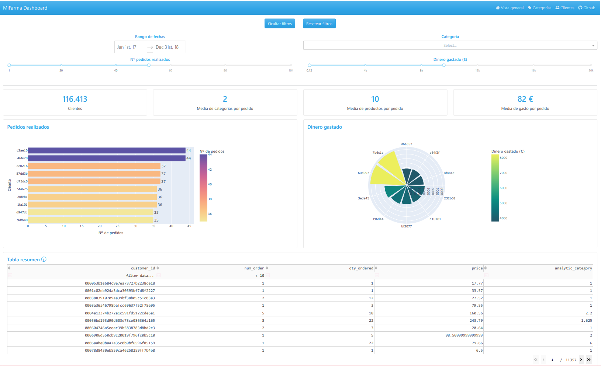

# Fase Local Datathon 2022 - Equipo Log(ic)

## Descripción

Este documento tiene como objetivo detallar todas las partes de la entrega para la primera fase de la competición. Explicaremos nuestra metodología de trabajo, las decisiones tomadas a lo largo del proceso de implementación y describiremos el funcionamiento de la herramienta que hemos creado.

La aplicación está disponible en este [enlace](https://datathon-logic-yv66bn7uua-ew.a.run.app) y el repositorio con todo el código está público en [GitHub](https://github.com/nikodyulger/datathon-logic).

## Metodología

Todo proyecto necesita ser gestionado y mas aún, si se trabaja en equipo. En nuestro caso, para la **planificación** hemos hecho uso de un tablero *Kanban*. Esto nos ha facilitado la organización del flujo de trabajo y el reparto de tareas entre los integrantes. Así en todo momento, sabemos quién está haciendo qué, qué falta por revisar, qué falta por hacer y qué tareas se han terminado.

Para el manejo del **control de versiones** del desarrollo hemos hecho uso de *GitFlow*. Esta metodología nos ha ayudado a evitar conflictos y dependencias entre las distintas partes del proyecto. Además de esto, hemos procurado seguir una estructura estándar de *repositorio* para garantizar que sea entendible por cualquiera.

En cuanto las fases del proyecto, hemos seguido los pasos *estándar* que se llevan a cabo en un proceso de minería de datos (**KDD**), a excepción de la creación de modelos, algo que hemos sustituido por la creación de una aplicación. Por los que distinguimos cuatro **fases**,comenzando por el *análisis exploratorio de los datos*, *limpieza y arreglo de los datos*, *implementación del dashboard* y finalmente la *documentación* de todo el trabajo.

## Herramientas

Para el desarrollo hemos utilizado en todo momento el poder de **Python**, el lenguaje predeterminado en la ciencia e ingeniería de datos. Por lo que las herramientas, en realidad son los módulos a los que hemos recurrido. Esta es una lista de ellos:

- **Pandas**. Para manejar y realizar operaciones con los conjuntos de datos.
- **Plotly**. Para crear visualizaciones interactivas a partir de los datos.
- **Dash**. Para desarrollar aplicaciones con las que mostrar lo aprendido de los datos. 
- **Geopy**. Para la extracción de puntos geográficos.
- **Spacy**. Para el procesamiento de textos.

## Análisis exploratorio

El primer paso en todo proceso de ingeniería de datos es llevar a cabo una inspección de los conjuntos de datos de los que se dispone. La exploración de cada *dataset* se detalla en diferentes cuadernos de Jupyter dentro de la carpeta `EDA`. En ellos se analiza con profundidad cada una de las variables, así como sus relaciones y posibles inconvenientes llegando a unas conclusiones que nos han servido a posteriori. A modo de resumen nos quedamos con los siguientes hechos de esta fase del proyecto:

1. Existen muchos datos perdidos en los tres datasets, pero un número considerable puede ser recuperado con las técnicas adecuadas.
2. Las claves con las que se relacionan las tablas no son del todo idóneas. Por ejemplo, no todos los `product_id` se encuentran en las tres tablas, como tampoco se trata de un identificador único. Esto acarrea problemas al intentar unir las tablas.
3. Falta de normalización/estandarización en los campos de tipos `texto`. Esto crea dificultades a la hora de realizar agrupaciones por estos campos, ya que los datos no son realmente representativos.

## Limpieza y arreglo

Sin duda alguna, la fase más problemática y costosa de implementar. Contar con un buen conjunto de datos es primordial para que las herramientas que se construyan por encima, funcionen correctamente. Todos los detalles están disponibles en los cuadernos Jupyter dentro de la carpeta `Clean Data`. Además en esta carpeta se encuentran los *datasets* ya limpios y arreglados, listos para ser utilizados. Nuestro objetivo ha sido adecuar el conjunto de `items` para que sea la base de las consultas que se vayan a realizar en el dashboard. Para ello, a grandes rasgos se ha hecho lo siguiente:

1. Para recuperar las categorías perdidas del conjunto productos, se han empleado varias técnicas. Se ha intentado recuperar todos los valores posibles, a través de la tabla de categorías. Después hemos utilizado las marcas como referencias para imputar valores y también hemos creado un diccionario con palabras clave a partir de las descripciones de los productos.
2. La tabla de items es con la que más inconvenientes nos hemos topado. Se han arreglado valores de precios, eliminado duplicados y se ha hecho un enorme esfuerzo en normalizar los campos de ubicación de los pedidos.

Respecto a lo referente de la localización de pedidos, queremos remarcar el esfuerzo que han supuesto dado que los *scripts* para extraer datos tardan en torno a unas **4 horas** en ejecutarse. Esto se debe a la ingente cantidad de consultas a la API que se han tenido que realizar.

## Dashboard

La aplicación en forma de dashboard que hemos creado tiene como propósito ayudar en la toma de decisiones. Digamos que nuestra intención es mostrar información relevante que permita mejorar las estrategias de marketing de la empresa. De esta manera, fomentaremos el crecimiento de las ventas, así como también los beneficios que se generan con ellas. 

La aplicación web consta de tres páginas, cada una dedicada a diferentes aspectos del conjunto de datos. En líneas generales, se ha procurado mantener una línea de diseño única para que así el *look and feel* sea más uniforme e intuitivo. De ahí que las páginas tengan una disposición de los elementos muy similar, pero variando la información junto con los filtros y gráficas que se muestran.

La aplicación en un principio está pensada para dispositivos de escritorio, aunque también se puede visualizar en dispositivos móviles a través de cualquier navegador por su diseño *responsive*. A pesar de esto, nuestra recomendación es utilizar pantallas más grandes para tener una mejor experiencia.

 
 
 

### Vista general

Se trata de la página principal del dashboard, la que uno ve nada más acceder a la aplicación. En ella podemos ver estadísticas generales como:

- El número total de pedidos
- Los beneficios totales
- La cantidad de productos vendidos
- El número de clientes

Con un rápido vistazo a estos números, uno se puede hacer a la idea de cómo va el negocio. Información que se completa con las gráficas de **tendencia** de compras, el **mapa** con los puntos donde más se vende, el reparto entre **categorías** según la cantidad de productos vendidos y por último el **ranking de los productos** más vendidos.

Los datos y gráficas son **interactivas**, es decir, uno puede *"jugar"* con ellas para visualizar los que le importa, incluso hacer capturas para crear informes posteriormente. Además de esto, con los **filtros** que se han desarrollado, uno puede focalizar la atención en un subconjunto de datos acorde a los criterior que imputa como parámetros. Así la búsqueda de información relevante es mucho más fácil.

**NOTA**. Los filtros de tipo `select` se puede buscar escribiendo o haciendo *scroll* entre las opciones que existen.

### Categorías

En esta página se muestra información respecto las distintas categorías de producto que ofrece el catálogo de MiFarma. Las estadísticas que se muestran son similares a la vista general, pero añadiendo el **precio medio** de los productos de dicha categoría.

En las gráficas podemos ver cómo es el reparto dentro de cada categoría. En el `treemap` se muestran las **20** marcas que más se venden (cantidades), mientras que el `sunburst` se observan las **10** marcas que más beneficios generan a la empresa. Debajo de estas dos, encontramos cómo se dividen las compras por categorías en las fechas señaladas.

A los filtros de antes, se les suma uno más de categorías para poder visualizar mejor los datos sobre estas mismas por separado o comparar entre dos o más, en lugar de tener siempre una equiparación de todas a la vez.

Con toda esta información, creemos que será más fácil orientar el catálogo de productos, ya sea añadir o quitar artículos, pero siempre con la idea en mente de potenciar la venta de ciertas marcas/categorías.

**NOTA**. Los tiempos de carga iniciales de las páginas varian ya que las consultas se realizan sobre un conjunto de datos relativamente grande. A esto debemos añadir, el tiempo de renderizado de las propias gráficas.

 

### Clientes

En esta página se muestra información acerca de los clientes, tales como:

- Gasto promedio por pedido
- Cantidad de productos media por pedido
- La media de productos de distintas categorías dentro de un pedido
- El número de clientes que satisfacen la búsqueda de los filtros

Los dos primeros gráficos exponen un ranking de los clientes, por un lado los que más **pedidos** realizan y por otro los que tienen mayor **desembolso** en el total de sus pedidos. Y debajo de estos, uno puede obtener información más detallada e inlcuso interactuar con ella, para encontrar el cliente que busca.

Los filtros cambian respecto a las dos páginas anteriores. Se prescinde del filtro de regiones y se añaden otros dos que son para acotar el conjunto de cliente según el número de pedidos y el desembolso que realizan. 

Así en general, lo que se espera con esta información es reconocer los cliente más fieles, como también a que tipos de clientes nos dirigimos, puediendo acotar más el público objetivo del negocio.

